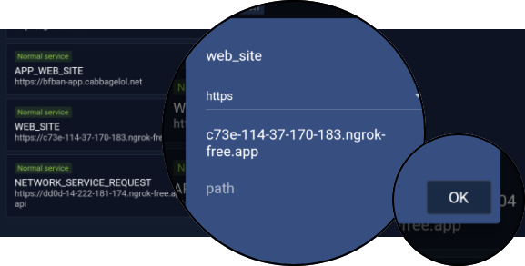

# 这是什么

这是一个调试工具，用于开发者随时提供远程测试做准备，它从0.2.4版本开始提供。

## 修改请求链接

不要使用任何未知人员提供的地址，它可能会盗窃你bfban账户，泄露信息

打开应用，从首页切换到`我`,点击`支援`>右上角>`Network monitoring`, 等待应用列出所有地址；

长按触发编辑, 打开窗口后需要填写几个项目:

- 请求名, 这很重要，程序仅使用特定名称
- 协议类型, 目前支持http或https
- 域名, 不要携带http(s), 单纯域名
- 地址, 接口地址

| 名称  | 描述         |
|-----|------------|
|  sentry   | 哨兵地址       |
|  web_github   | github网站地址 |
|  app_web_site   | app网站地址    |
|  web_site   | bfban 网站地址 |
|  network_service_request  | 通用请求地址     |

按下确认保存。

## web_site 可用测试地址
- (推荐) https://bfban.github.io/bfban-website
- https://cabbagelol.github.io/bfban-website

## network_service_request 可用测试地址
- bfban-app.cabbagelol.net/api
- bfban-dev.gametools.network/api

### 使用本地开发
- 127.0.0.1
- 10.0.2.2

启动bfban后端，查看https://github.com/BFBAN/bfban-website/tree/master/backend
